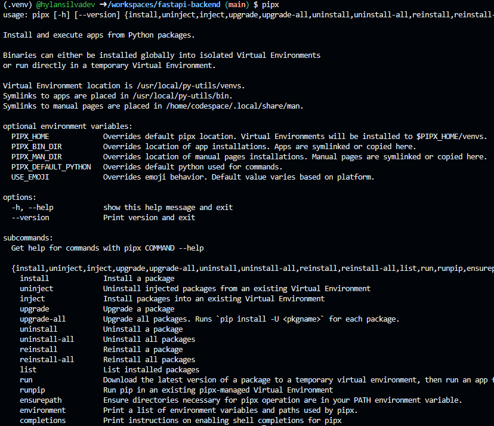

# fastapi-backend

## Instruções para criar o ambiente de desenvolvimento

### Github [Codespaces]

Caso voe esteja utilizando o github codespaces para estudar o projeto ou ir acompanhando durante os estudos, temos aqui um passo a passo.

- Atualizar o terminal:
    
    dentro do seu terminal do editor do github codespaces escreva os comandos...

    ~~~bash
       sudo apt update
    ~~~ 
- Instalar o **Pipx**

    após atualização, vamos instalar uma ferramenta de gestão de projetos chamada **Pipx**
    ~~~bash
       sudo apt install pipx
    ~~~ 
    finalizado a instalação, escreva no seu terminal `pipx`. isso fará com que o menú de comandos do Pipx apareça:

    

    caso não apareça para você. leia a documentação do pipx para saber em qual etapa você cometeu erro. [Clique aqui para ler a documentação do pipx](https://github.com/pypa/pipx)
- Instalar o **Poetry**

    com o Pipx instalado agora vamos instalar a ferramenta de gerenciamento do bibliotecas chamada **Poetry**
    ~~~bash
       pipx install poetry
    ~~~ 
    finalizado a instalação, escreva no seu terminal `poetry`. isso fará com que o menú de comandos do Poetry apareça.

    caso não apareça para você. leia a documentação do Poetry para saber em qual etapa você cometeu erro. [Clique aqui para ler a documentação do Poetry](https://python-poetry.org/docs/)

- Instalando o **Pyenv**

    O **Pyenv é um gerenciador de versões do python, ele serve para que passamos mudar a versão do projeto, instalar novas versões, etc..

    vamos instalar-lo escrevendos estes comandos:
    ~~~bash
       curl https://pyenv.run | bash
    ~~~

    como cada distro do linux, armazena de uma maneira diferente os lugares onde salva os arquivos de programas, vamos fazer uma configuração universal, enviando os `Path`'s de todos eles para uma perfil padrão.
    - Primeiro, adicione os comandos abaixo e execute em seu terminal:
        ```bash
        echo 'export PYENV_ROOT="$HOME/.pyenv"' >> ~/.bashrc
        echo 'command -v pyenv >/dev/null || export PATH="$PYENV_ROOT/bin:$PATH"' >> ~/.bashrc
        echo 'eval "$(pyenv init -)"' >> ~/.bashrc
        ```
    - Em seguida, se você tiver um `~/.profile`, `~/.bash_profile` ou `~/.bash_login`, adicione a linha de comando `~/.bash_profile`, caso não tenha adicione a `~/.profile`.

        - Para adicionar o `~/.profile`
           
            ```bash
            echo 'export PYENV_ROOT="$HOME/.pyenv"' >> ~/.bashrc
            echo 'command -v pyenv >/dev/null || export PATH="$PYENV_ROOT/bin:$PATH"' >> ~/.bashrc
            echo 'eval "$(pyenv init -)"' >> ~/.bashrc
            ```

        - Para adicionar o `~/.bash_profile`

            ```bash
            echo 'export PYENV_ROOT="$HOME/.pyenv"' >> ~/.bash_profile
            echo '[[ -d $PYENV_ROOT/bin ]] && export PATH="$PYENV_ROOT/bin:$PATH"' >> ~/.bash_profile
            echo 'eval "$(pyenv init -)"' >> ~/.bash_profile
            ```

        dica: **Eu (Hylan Silva), adiciono todos os 3 comandos ao meu terminal por padrão.**

    - Reiniciar o Terminal

        por fim após toda a instalação e configuração do Pyenv, vamos reiniar o términal

        ~~~bash
            exec "$SHELL"
        ~~~

Desenvolvido com 🩷  por: [Hylan Silva](https://www.github.com/hylansilvadev)